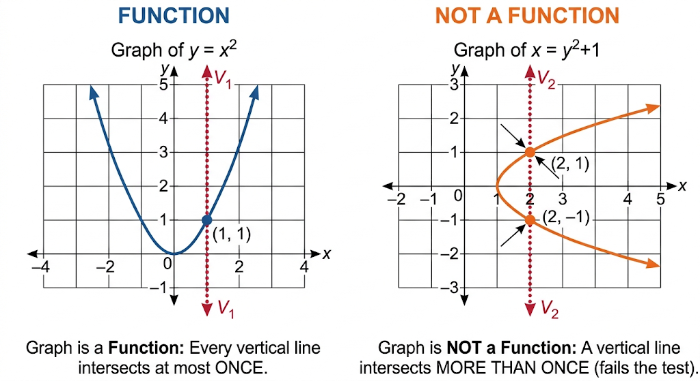

```{r}
#| echo: false
#| warning: false
#| message: false

library(readr)
library(dplyr)
library(stringr)

# =================================
# GOOGLE SHEET
# =================================

sheet_url <- "https://docs.google.com/spreadsheets/d/e/2PACX-1vSS9xAr-Vm_XPEKsvPz9A1RWtIEW3R50nqcilODNggostrkW7ms5O84Dgrp9vheOer-K8Pu5PDtsgg2/pub?output=csv"

lectures <- read_csv(
  sheet_url,
  show_col_types = FALSE
)

# =================================
# DETECT CURRENT QMD FILE
# =================================

current_file <- knitr::current_input(
  dir = FALSE
)

current_filename <- basename(
  current_file
)

# =================================
# EXTRACT LECTURE NUMBER
# =================================

lecture_match <- str_match(
  current_filename,
  "lecture-([0-9]+)"
)

if (is.na(lecture_match[1, 2])) {

  stop(
    paste0(
      "Could not detect lecture number from file: ",
      current_filename
    )
  )

}

lecture_no <- as.integer(
  lecture_match[1, 2]
)

# =================================
# FIND MATCHING LECTURE
# =================================

lecture <- lectures %>%
  filter(
    !is.na(`CLASS NO.`),
    as.integer(`CLASS NO.`) == lecture_no
  ) %>%
  slice(1)

# =================================
# DEFAULT VALUES
# =================================

lecture_date <- ""
chapter <- ""
content <- ""

# =================================
# GET DATA
# =================================

if (nrow(lecture) > 0) {

  lecture_date <- lecture$`TUTORING DATE`[1]

  chapter <- lecture$`CHAPTERS & PAPER`[1]

  content <- lecture$CONTENT[1]

}

# =================================
# HANDLE NA
# =================================

if (is.na(lecture_date)) {
  lecture_date <- ""
}

if (is.na(chapter)) {
  chapter <- ""
}

if (is.na(content)) {
  content <- ""
}

# =================================
# CONVERT TO CHARACTER
# =================================

lecture_date <- str_trim(
  as.character(lecture_date)
)

chapter <- str_trim(
  as.character(chapter)
)

content <- str_trim(
  as.character(content)
)

# =================================
# FORMAT CHAPTER LINE BREAKS
# =================================

chapter <- str_replace_all(
  chapter,
  "\\r?\\n",
  "<br>"
)

# =================================
# WEEKLY EXAM DETECTION
# =================================

weekly_exam_match <- str_match(
  content,
  "^\\s*([0-9]+)\\s*-\\s*Weekly exam of previous lectures and problem solving\\s*$"
)

is_weekly_exam <- !is.na(
  weekly_exam_match[1, 1]
)

# =================================
# WEEKLY EXAM NUMBER
# =================================

weekly_exam_no <- ""

if (is_weekly_exam) {

  weekly_exam_no <- sprintf(
    "%02d",
    as.integer(
      weekly_exam_match[1, 2]
    )
  )

}

# =================================
# WEEKLY EXAM DESCRIPTION
# =================================

weekly_exam_description <- ""

if (is_weekly_exam) {

  weekly_exam_description <-
    "Weekly exam of previous lectures and problem solving"

}

# =================================
# WEEKLY EXAM BADGE
# =================================

weekly_badge <- ""

if (is_weekly_exam) {

  weekly_badge <- paste0(
    '<span class="weekly-exam-corner-badge">',
    'MARKS 30',
    '</span>'
  )

}

```

::::::: lecture-header-card
::::: lecture-header-main
[HIGHER MATHEMATICS]{.lecture-subject}

::: lecture-title-row
# `r if (is_weekly_exam) "Weekly " else "Lecture "` `r sprintf("%02d", if (is_weekly_exam) as.integer(weekly_exam_no) else lecture_no)`
:::

::: lecture-chapter
`r chapter`
:::

`r if (!is_weekly_exam) content`
:::::

::: lecture-header-date
<span>`r lecture_date`</span>
:::

<span>`r weekly_badge`</span>
:::::::

## Introduction

In this lecture we are reviewing the concept of function and relation, basic properties of a function and a relation, diffirent types of function, how to check wheter a relation is function or not using vertical line test and related problems.

------------------------------------------------------------------------

# Relation

### Definition

Let $A$ and $B$ be two non-empty sets. A **relation** $R$ from $A$ to $B$ is a subset of the Cartesian product $A \times B$. That is, $R \subseteq A \times B = \{(a, b) \mid a \in A, b \in B\}$. If an element $a \in A$ is related to an element $b \in B$ under $R$, we write $(a, b) \in R$ or $a \, R \, b$.

### Example

Let $A = \{1, 2, 3\}$ and $B = \{4, 5\}$. The Cartesian product is: $$A \times B = \{(1, 4), (1, 5), (2, 4), (2, 5), (3, 4), (3, 5)\}$$

Define a relation $R$ from $A$ to $B$ by the rule "is less than": $$R = \{(a, b) \in A \times B \mid a < b\}$$

Since every element in $A$ is strictly less than every element in $B$, we obtain: $$R = \{(1, 4), (1, 5), (2, 4), (2, 5), (3, 4), (3, 5)\}$$

Now consider a restricted relation $R_1 = \{(1, 4), (1, 5), (2, 5)\}$. Notice that $1 \in A$ is associated with both $4 \in B$ and $5 \in B$. This remains a valid relation, as any arbitrary subset of $A \times B$ constitutes a relation.

# Function

### Definition

Let $X$ and $Y$ be non-empty sets. A **function** $f$ from $X$ to $Y$ (denoted $f: X \to Y$) is a specific type of relation that associates with each element $x \in X$ a **unique** element $y \in Y$. We write $y = f(x)$, where $y$ is called the image of $x$ under $f$, and $x$ is called the pre-image of $y$.

### Properties

For a relation $R \subseteq X \times Y$ to qualify as a function $f: X \to Y$, it must satisfy two essential conditions:

-   **Totality (Existence):** Every element in the domain $X$ must be mapped to at least one element in $Y$. Formally: $$\forall x \in X, \exists y \in Y \text{ such that } (x, y) \in f$$
-   **Uniqueness (Well-definedness):** No element in $X$ can be mapped to more than one element in $Y$. Formally: $$\forall x \in X, \forall y_1, y_2 \in Y, \quad \left( (x, y_1) \in f \land (x, y_2) \in f \right) \implies y_1 = y_2$$

### Example

Let $X = \{1, 2, 3\}$ and $Y = \{2, 4, 6, 8\}$. Define $f: X \to Y$ by the rule $f(x) = 2x$.

The set of ordered pairs for $f$ is: $$f = \{(1, 2), (2, 4), (3, 6)\}$$

-   **Totality Check:** Every element of $X$ ($\{1, 2, 3\}$) appears exactly once as a first coordinate.
-   **Uniqueness Check:** No element in $X$ maps to multiple elements in $Y$. Thus, $f$ is a well-defined function.

# Main Difference of Relation and Function

### Main Points of Difference

| Feature | Relation | Function |
|:-----------------------|:-----------------------|:-----------------------|
| **Mapping Restriction** | An element of the domain can map to zero, one, or multiple elements in the codomain. | Every element of the domain **must** map to **exactly one** element in the codomain. |
| **Existence Requirement** | Some elements in the domain set do not need to have an image. | Every element in the domain **must** have an image. |
| **Generality** | Every function is a relation ($f \subseteq X \times Y$). | Not every relation is a function; it is a restricted relation. |

### Vertical Line Test for Functions from a Graph

A visual method to determine whether a curve in the Cartesian plane represents a function $y = f(x)$ is the **Vertical Line Test**:

> A graph in the $xy$-plane represents a function of $x$ if and only if **no vertical line** intersects the graph at more than one point.



-   **If a vertical line intersects the graph at two or more points:** The same $x$-value maps to multiple $y$-values, violating uniqueness. It is a relation, not a function.
-   **If every vertical line intersects the graph at most once:** The graph represents a well-defined function.

# Problems

**Problem 1: Evaluate** $y^2 = x^2$

-   *Algebraic Analysis:* Solving for $y$ yields $y = \pm \sqrt{x^2} = \pm |x|$. For $x = 2$, $y = 2$ or $y = -2$. The single input $x = 2$ yields two output values, violating uniqueness.
-   *Conclusion:* $y^2 = x^2$ defines a **relation**, but **not a function**.

**Problem 2: Evaluate** $y = x^2$

-   *Algebraic Analysis:* For every real input $x$, $x^2$ produces a single, non-negative real number. For example, $x = 2 \implies y = 4$ and $x = -2 \implies y = 4$. Multiple inputs can share an output, but each input has a unique output.
-   *Conclusion:* $y = x^2$ is a valid **function**.

**Problem 3: Evaluate** $x^2 + y^2 = 9$

-   *Algebraic Analysis:* Solving for $y$ yields $y = \pm \sqrt{9 - x^2}$. For $x = 0$, $y = 3$ or $y = -3$. A vertical line at $x = 0$ touches the circle at two points: $(0, 3)$ and $(0, -3)$.
-   *Conclusion:* It is a **relation**, but **not a function**.

------------------------------------------------------------------------

# Types of Functions

### Injective (One-to-One)

A function $f: X \to Y$ is **injective** if distinct elements in $X$ map to distinct elements in $Y$. $$\forall x_1, x_2 \in X, \quad f(x_1) = f(x_2) \implies x_1 = x_2$$ *Example:* $f: \mathbb{R} \to \mathbb{R}$ defined by $f(x) = 3x + 1$. If $3x_1 + 1 = 3x_2 + 1$, then $x_1 = x_2$.

### Surjective (Onto)

A function $f: X \to Y$ is **surjective** if every element in the codomain $Y$ is the image of at least one element in the domain $X$. $$\forall y \in Y, \quad \exists x \in X \text{ such that } f(x) = y$$ *Example:* $f: \mathbb{R} \to \mathbb{R}$ defined by $f(x) = x^3$. For any $y \in \mathbb{R}$, there exists $x = \sqrt[3]{y} \in \mathbb{R}$ such that $f(x) = y$.

### Bijective (One-to-One and Onto)

A function $f: X \to Y$ is **bijective** if it is both injective and surjective. Bijective functions possess an inverse function $f^{-1}: Y \to X$. *Example:* $f: \mathbb{R} \to \mathbb{R}$ defined by $f(x) = 2x - 5$. It is both one-to-one and onto; hence it is bijective.

------------------------------------------------------------------------

# Image

### Definition

Let $f: X \to Y$ be a function. For any element $x \in X$, the element $y \in Y$ assigned to $x$ under $f$ is called the **image** of $x$ under $f$, denoted $y = f(x)$.

More generally, for a subset $A \subseteq X$, the image of $A$ under $f$ is the set of all images of its elements: $$f(A) = \{f(x) \in Y \mid x \in A\}$$

### Example

Consider the function $f: \mathbb{R} \to \mathbb{R}$ defined by $f(x) = 2x - 1$.

-   **Single Element Image:** To find the image of $x = 2$, evaluate the function at $2$: $$f(2) = 2(2) - 1 = 3$$ Here, $3$ is the image of $2$ under $f$ (and $2$ is the pre-image of $3$).

-   **Subset Image:** For the set $A = \{0, 1, 2\}$, evaluating each element yields:

    -   $f(0) = -1$
    -   $f(1) = 1$
    -   $f(2) = 3$

    Therefore, the image of the set $A$ is $f(A) = \{-1, 1, 3\}$.

------------------------------------------------------------------------

# Inverse Function

### Definition

Let $f: X \to Y$ be a **bijective** function. The **inverse function** of $f$, denoted $f^{-1}: Y \to X$, is the unique function that reverses the mapping of $f$. It is defined such that for every $x \in X$ and $y \in Y$: $$f^{-1}(y) = x \iff f(x) = y$$

A function has a well-defined inverse if and only if it is bijective (both injective and surjective).

### Key Properties

-   **Composition Identity:** Composing a function with its inverse yields the identity function: $$(f^{-1} \circ f)(x) = x \quad \forall x \in X$$ $$(f \circ f^{-1})(y) = y \quad \forall y \in Y$$
-   **Graphical Symmetry:** The graph of $y = f^{-1}(x)$ is the reflection of the graph of $y = f(x)$ across the line $y = x$.
-   **Domain and Range Swap:** $$\operatorname{Dom}(f^{-1}) = \operatorname{Ran}(f)$$ $$\operatorname{Ran}(f^{-1}) = \operatorname{Dom}(f)$$

### Example & Method to Find Inverse

Find the inverse of $f: \mathbb{R} \to \mathbb{R}$ given by $f(x) = 2x + 3$.

1.  **Set** $y = f(x)$: $$y = 2x + 3$$
2.  **Solve algebraically for** $x$ in terms of $y$: $$y - 3 = 2x \implies x = \frac{y - 3}{2}$$
3.  **Replace** $x$ with $f^{-1}(y)$ (or swap variables to express as a function of $x$): $$f^{-1}(x) = \frac{x - 3}{2}$$

-   **Verification with Real Values:**
    -   Using $f(x)$: $f(2) = 2(2) + 3 = 7$.
    -   Using $f^{-1}(x)$: $f^{-1}(7) = \frac{7 - 3}{2} = 2$.

------------------------------------------------------------------------

### Problems: Finding Inverse Functions

**Problem 1: Linear Function**  
Find the inverse of $f(x) = \frac{3x - 5}{2}$ defined on $f: \mathbb{R} \to \mathbb{R}$.

* **Step 1 (Set $y = f(x)$):**
  $$y = \frac{3x - 5}{2}$$

* **Step 2 (Solve for $x$ in terms of $y$):**
  $$2y = 3x - 5$$
  $$3x = 2y + 5 \implies x = \frac{2y + 5}{3}$$

* **Step 3 (Write $f^{-1}(x)$):**
  $$f^{-1}(x) = \frac{2x + 5}{3}$$

---

**Problem 2: Rational Function with Domain Restriction**  
Find the inverse of $g(x) = \frac{2x + 1}{x - 4}$ where $\operatorname{Dom}(g) = \mathbb{R} \setminus \{4\}$.

* **Step 1 (Set $y = g(x)$):**
  $$y = \frac{2x + 1}{x - 4}$$

* **Step 2 (Isolate $x$):**
  $$y(x - 4) = 2x + 1$$
  $$xy - 4y = 2x + 1$$
  $$xy - 2x = 4y + 1$$
  $$x(y - 2) = 4y + 1 \implies x = \frac{4y + 1}{y - 2}$$

* **Step 3 (Write $g^{-1}(x)$ and state its domain):**
  $$g^{-1}(x) = \frac{4x + 1}{x - 2}$$
  $$\operatorname{Dom}(g^{-1}) = \operatorname{Ran}(g) = \mathbb{R} \setminus \{2\}$$

---

**Problem 3: Radical Function with Restricted Domain**  
Find the inverse of $h(x) = \sqrt{x - 3} + 2$ where $\operatorname{Dom}(h) = [3, \infty)$ and $\operatorname{Ran}(h) = [2, \infty)$.

* **Step 1 (Set $y = h(x)$):**
  $$y = \sqrt{x - 3} + 2 \quad (y \ge 2)$$

* **Step 2 (Solve for $x$):**
  $$y - 2 = \sqrt{x - 3}$$
  $$(y - 2)^2 = x - 3 \implies x = (y - 2)^2 + 3$$

* **Step 3 (Write $h^{-1}(x)$ with explicit domain restriction):**
  $$h^{-1}(x) = (x - 2)^2 + 3 \quad \text{for } x \ge 2$$
  *(Note: The domain restriction $x \ge 2$ is necessary because $\operatorname{Dom}(h^{-1}) = \operatorname{Ran}(h) = [2, \infty)$.)*

------------------------------------------------------------------------

# Domain

### Formal Definition

The **domain** of a function $f: X \to Y$, denoted $\operatorname{Dom}(f)$, is the set of all inputs $x \in X$ for which the function is defined and produces a real (or valid) output.

### How to Find the Domain?

To find the domain over real numbers $\mathbb{R}$, establish domain restrictions to prevent undefined operations:

1.  **Polynomial Form (**$ax + b$, $ax^2 + bx + c$): Defined for all real numbers. $$\text{Domain} = \mathbb{R} = (-\infty, \infty)$$
2.  **Rational Form (**$\frac{g(x)}{h(x)}$): Division by zero is undefined. $$\text{Condition: } h(x) \neq 0$$
3.  **Square Root Form (**$\sqrt{g(x)}$): Even roots of negative numbers are non-real. $$\text{Condition: } g(x) \ge 0$$
4.  **Logarithmic Form (**$\log(g(x))$): Logarithms require strictly positive arguments. $$\text{Condition: } g(x) > 0$$
5.  **Combined Rational and Radical Form (**$\frac{1}{\sqrt{g(x)}}$): $$\text{Condition: } g(x) > 0$$

------------------------------------------------------------------------

# Codomain

### Definition

The **codomain** of a function $f: X \to Y$ is the entire set $Y$ into which all outputs of the function are declared to fall. It is specified as part of the function's signature.

### Example

In the function definition $f: \mathbb{R} \to \mathbb{R}$ given by $f(x) = x^2$, the codomain is $\mathbb{R}$ (the set of all real numbers).

------------------------------------------------------------------------

# Range

### Definition

The **range** (or image) of a function $f: X \to Y$, denoted $\operatorname{Ran}(f)$ or $f(X)$, is the set of all actual output values produced by applying $f$ to elements of $X$. $$\operatorname{Ran}(f) = \{y \in Y \mid \exists x \in X, f(x) = y\}$$

### Example

For $f: \mathbb{R} \to \mathbb{R}$ defined by $f(x) = x^2$, the range is the set of all non-negative real numbers: $$\operatorname{Ran}(f) = [0, \infty)$$

# Difference Between Codomain and Range

-   The **codomain** is the target set declared in the function specification ($Y$).
-   The **range** is the actual subset of elements in $Y$ that are hit by the mapping ($\operatorname{Ran}(f) \subseteq Y$).
-   A function is **surjective** if and only if $\text{Range} = \text{Codomain}$.

------------------------------------------------------------------------

# Problems: Finding Domain and Range

**Problem 1: Find the domain and range of** $f(x) = \frac{1}{x - 3}$

-   **Domain:** The denominator cannot be zero: $$x - 3 \neq 0 \implies x \neq 3$$ $$\operatorname{Dom}(f) = \mathbb{R} \setminus \{3\} = (-\infty, 3) \cup (3, \infty)$$

-   **Range:** Let $y = \frac{1}{x - 3}$. Solve for $x$: $$y(x - 3) = 1 \implies x - 3 = \frac{1}{y} \implies x = \frac{1}{y} + 3$$ For $x$ to exist as a real number, $y \neq 0$. $$\operatorname{Ran}(f) = \mathbb{R} \setminus \{0\} = (-\infty, 0) \cup (0, \infty)$$

------------------------------------------------------------------------

**Problem 2: Find the domain and range of** $g(x) = \sqrt{4 - x^2}$

-   **Domain:** The expression under the radical must be non-negative: $$4 - x^2 \ge 0 \implies x^2 \le 4 \implies -2 \le x \le 2$$ $$\operatorname{Dom}(g) = [-2, 2]$$

-   **Range:** Since $x \in [-2, 2]$, $0 \le x^2 \le 4$. Evaluating the boundary values:

    -   Minimum value occurs when $x^2 = 4 \implies g(x) = \sqrt{4 - 4} = 0$.
    -   Maximum value occurs when $x^2 = 0 \implies g(x) = \sqrt{4 - 0} = 2$. $$\operatorname{Ran}(g) = [0, 2]$$

------------------------------------------------------------------------

**Problem 3: Find the domain of** $h(x) = \log(x^2 - 5x + 6)$

-   **Domain:** The argument of the logarithm must be strictly greater than zero: $$x^2 - 5x + 6 > 0 \implies (x - 2)(x - 3) > 0$$ Solving the inequality yields: $$x < 2 \quad \text{or} \quad x > 3$$ $$\operatorname{Dom}(h) = (-\infty, 2) \cup (3, \infty)$$

------------------------------------------------------------------------

# Practice Problems

------------------------------------------------------------------------

::: q-card
[**Question 1**]{.q-number}

**Define the following terms with suitable examples:  **

a) Function
b) Injective Function (One-to-One Function)
c) Surjective Function (Onto Function) 
d) Image of a Function
:::

::: q-card
[**Question 2**]{.q-number}

**Find the domain and range of the real-valued function $f(x) = \sqrt{x^2 + 25}$.**
:::

::: q-card
[**Question 3**]{.q-number}

**Consider the relation given by $y = \frac{x + 1}{x - 2}$.  **

a) Plot the graph of the relation on a Cartesian coordinate plane.  
b) Using the **Vertical Line Test**, demonstrate whether this relation is a function.  
c) Determine the inverse relation $f^{-1}(x)$ and state its domain.  
:::

::: q-card
[**Question 4**]{.q-number}
[**BUET: 17-18**]{.q-number}

**In a circle centered at $O$, the radius is $10\text{ cm}$ and the length of the arc $AB$ is $14\text{ cm}$.**

1. Determine the measure of $\angle AOB$ (in degrees, minutes, and seconds).
2. Calculate the area of the smaller region enclosed by the arc $AB$ and the chord $AB$ (the minor segment).
:::

::: lecture-navigation
[← Previous Lecture](index.qmd){.lecture-nav-btn}

[Next Lecture →](lecture-02.qmd){.lecture-nav-btn}
:::

<br>

::: contact-social
<a href="https://github.com/TurjoMahir"
   target="_blank"
   aria-label="GitHub"> <i class="fa-brands fa-github"></i> </a>

<a href="https://www.linkedin.com/in/md-foysal-uddin-3aa47a406/"
   target="_blank"
   aria-label="LinkedIn"> <i class="fa-brands fa-linkedin-in"></i> </a>

<a href="https://www.facebook.com/foysal.uddin.turjo.2005"
   target="_blank"
   aria-label="Facebook"> <i class="fa-brands fa-facebook-f"></i> </a>

<a href="mailto:foysaluddinturjo@gmail.com"
   aria-label="Email"> <i class="fa-solid fa-envelope"></i> </a>
:::
