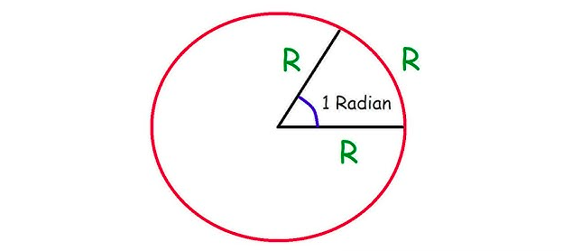
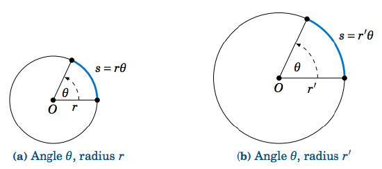
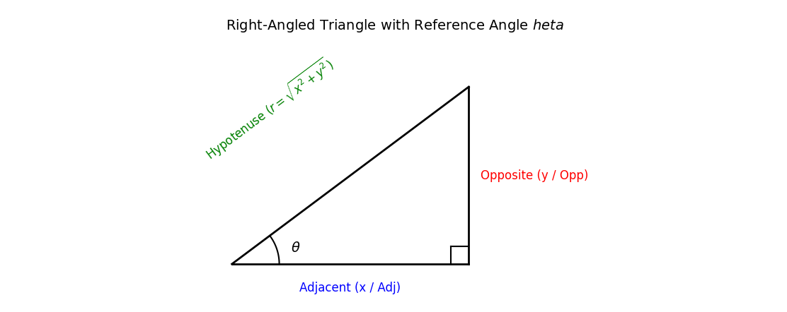

```{r}
#| echo: false
#| warning: false
#| message: false

library(readr)
library(dplyr)
library(stringr)

# =================================
# GOOGLE SHEET
# =================================

sheet_url <- "https://docs.google.com/spreadsheets/d/e/2PACX-1vSS9xAr-Vm_XPEKsvPz9A1RWtIEW3R50nqcilODNggostrkW7ms5O84Dgrp9vheOer-K8Pu5PDtsgg2/pub?output=csv"

lectures <- read_csv(
  sheet_url,
  show_col_types = FALSE
)

# =================================
# DETECT CURRENT QMD FILE
# =================================

current_file <- knitr::current_input(
  dir = FALSE
)

current_filename <- basename(
  current_file
)

# =================================
# EXTRACT LECTURE NUMBER
# =================================

lecture_match <- str_match(
  current_filename,
  "lecture-([0-9]+)"
)

if (is.na(lecture_match[1, 2])) {

  stop(
    paste0(
      "Could not detect lecture number from file: ",
      current_filename
    )
  )

}

lecture_no <- as.integer(
  lecture_match[1, 2]
)

# =================================
# FIND MATCHING LECTURE
# =================================

lecture <- lectures %>%
  filter(
    !is.na(`CLASS NO.`),
    as.integer(`CLASS NO.`) == lecture_no
  ) %>%
  slice(1)

# =================================
# DEFAULT VALUES
# =================================

lecture_date <- ""
chapter <- ""
content <- ""

# =================================
# GET DATA
# =================================

if (nrow(lecture) > 0) {

  lecture_date <- lecture$`TUTORING DATE`[1]

  chapter <- lecture$`CHAPTERS & PAPER`[1]

  content <- lecture$CONTENT[1]

}

# =================================
# HANDLE NA
# =================================

if (is.na(lecture_date)) {
  lecture_date <- ""
}

if (is.na(chapter)) {
  chapter <- ""
}

if (is.na(content)) {
  content <- ""
}

# =================================
# CONVERT TO CHARACTER
# =================================

lecture_date <- str_trim(
  as.character(lecture_date)
)

chapter <- str_trim(
  as.character(chapter)
)

content <- str_trim(
  as.character(content)
)

# =================================
# FORMAT CHAPTER LINE BREAKS
# =================================

chapter <- str_replace_all(
  chapter,
  "\\r?\\n",
  "<br>"
)

# =================================
# WEEKLY EXAM DETECTION
# =================================

weekly_exam_match <- str_match(
  content,
  "^\\s*([0-9]+)\\s*-\\s*Weekly exam of previous lectures and problem solving\\s*$"
)

is_weekly_exam <- !is.na(
  weekly_exam_match[1, 1]
)

# =================================
# WEEKLY EXAM NUMBER
# =================================

weekly_exam_no <- ""

if (is_weekly_exam) {

  weekly_exam_no <- sprintf(
    "%02d",
    as.integer(
      weekly_exam_match[1, 2]
    )
  )

}

# =================================
# WEEKLY EXAM DESCRIPTION
# =================================

weekly_exam_description <- ""

if (is_weekly_exam) {

  weekly_exam_description <-
    "Weekly exam of previous lectures and problem solving"

}

# =================================
# WEEKLY EXAM BADGE
# =================================

weekly_badge <- ""

if (is_weekly_exam) {

  weekly_badge <- paste0(
    '<span class="weekly-exam-corner-badge">',
    'WEEKLY ',
    weekly_exam_no,
    '</span>'
  )

}

```

::::::: lecture-header-card
::::: lecture-header-main
[HIGHER MATHEMATICS]{.lecture-subject}

::: lecture-title-row
# Lecture `r sprintf("%02d", lecture_no)`
:::

::: lecture-chapter
`r chapter`
:::

`r if (!is_weekly_exam) content`
:::::

::: lecture-header-date
<span>`r lecture_date`</span>
:::

`r weekly_badge`
:::::::

------------------------------------------------------------------------

# Angle Concepts & Systems of Measurement

### Angle

An **angle** is formed by the rotation of a ray about a fixed point
(called the *vertex*) from an initial position (initial side) to a
terminal position (terminal side).

#### Two Types of Angles: Geometric and Trigonometric

-   **Geometric Angle:** Formed by the union of two static non-collinear
    rays meeting at a common endpoint.
-   **Trigonometric Angle:** Formed by the dynamic rotation of a single
    ray about a fixed point from an initial vector to a terminal vector.

#### Differences Between Geometric and Trigonometric Angles

| Feature | Geometric Angle | Trigonometric Angle |
|:-----------------------|:-----------------------|:-----------------------|
| **Magnitude Range** | Restricted to $0^\circ \le \theta \le 360^\circ$. | Unbounded: $-\infty < \theta < \infty$. |
| **Sign / Direction** | Always non-negative (direction is irrelevant). | Signed: Anti-clockwise rotation is **positive** ($+$); Clockwise rotation is **negative** ($-$). |
| **Multiple Rotations** | Cannot exceed $360^\circ$ (one full rotation). | Accounts for multiple full revolutions (e.g., $750^\circ = 2 \times 360^\circ + 30^\circ$). |

------------------------------------------------------------------------

### Angle Systems of Unit Measurement

#### 1. Sexagesimal System (English System)

In this system, a right angle is divided into $90$ equal parts called
**degrees** ($^\circ$).

-   $1 \text{ Right Angle} = 90^\circ$ (Degrees)
-   $1^\circ = 60'$ (Minutes of arc)
-   $1' = 60''$ (Seconds of arc)

#### 2. Circular System (Radian System)

The standard SI unit for angular measure in pure mathematics.

-   **Definition of Radian (**$1^c$ or $1 \text{ rad}$): One **radian**
    is the measure of an angle subtended at the center of a circle by an
    arc whose length is equal to the radius of the circle.



#### 3. Centesimal System (French System)

A metric-aligned system where a right angle is divided into $100$ equal
parts called **grades** or **gradians** ($\text{gon}$ or $^\text{g}$).

-   **Definition:** $1 \text{ Grade}$ ($1^\text{g}$) is
    $\frac{1}{100}\text{th}$ of a right angle.
-   $1 \text{ Right Angle} = 100^\text{g}$ (Grades)
-   $1^\text{g} = 100^\text{c}$ (Centesimal Minutes)
-   $1^\text{c} = 100^\text{cc}$ (Centesimal Seconds)

------------------------------------------------------------------------

### Conversion Between Units

Since
$1 \text{ Right Angle} = 90^\circ = 100^\text{g} = \frac{\pi}{2} \text{ radians}$:

$$\pi \text{ radians} = 180^\circ = 200^\text{g}$$

#### Fundamental Conversion Formulas

$$1^\circ = \frac{\pi}{180} \text{ rad} \approx 0.017453 \text{ rad}$$
$$1 \text{ rad} = \left(\frac{180}{\pi}\right)^\circ \approx 57^\circ 17' 45''$$

#### Conversions

-   **Degree-Minute-Second (DMS) to Radians:** Convert minutes and
    seconds to decimal degrees first:
    $$\theta^\circ = D + \frac{M}{60} + \frac{S}{3600}$$
    $$\theta \text{ (rad)} = \theta^\circ \times \frac{\pi}{180}$$

-   **Radians to Degree-Minute-Second:** Multiply by $\frac{180}{\pi}$
    to get decimal degrees, then convert fractional parts to minutes
    ($\times 60$) and seconds ($\times 60$).

------------------------------------------------------------------------

# Circular Geometry: Arcs & Sectors

### Arc Distance Formula ($s = r\theta$)



Let a circle have radius $r$. An arc of length $s$ subtends an angle
$\theta$ **in radians** at the center.

$$\theta = \frac{\text{Arc Length}}{\text{Radius}} = \frac{s}{r} \implies s = r\theta \quad (\theta \text{ MUST be in radians})$$

### Area of a Circular Sector

#### Derivation

The area of a full circle ($\pi r^2$) corresponds to a central angle of
$2\pi$ radians. By linear proportion:

$$\frac{\text{Area of Sector}}{\text{Area of Circle}} = \frac{\text{Central Angle}}{2\pi}$$

$$\frac{A}{\pi r^2} = \frac{\theta}{2\pi} \implies A = \frac{1}{2} r^2 \theta$$

Using $s = r\theta$, this can also be expressed as:
$$A = \frac{1}{2} r s$$

------------------------------------------------------------------------

# Trigonometric Ratios & Core Identities

For an acute angle $\theta$ in a right-angled triangle with Opp
(opposite), Adj (adjacent), and Hyp (hypotenuse):



### Definitions & Reciprocal Relations

$$\sin\theta = \frac{\text{Opp}}{\text{Hyp}} = \frac{y}{r}, \quad \csc\theta = \frac{1}{\sin\theta} = \frac{r}{y}$$
$$\cos\theta = \frac{\text{Adj}}{\text{Hyp}} = \frac{x}{r}, \quad \sec\theta = \frac{1}{\cos\theta} = \frac{r}{x}$$
$$\tan\theta = \frac{\text{Opp}}{\text{Adj}} = \frac{y}{x}, \quad \cot\theta = \frac{1}{\tan\theta} = \frac{x}{y}$$

### Quotient Identities

$$\tan\theta = \frac{\sin\theta}{\cos\theta}, \quad \cot\theta = \frac{\cos\theta}{\sin\theta}$$

### Pythagorean Identities

$$\sin^2\theta + \cos^2\theta = 1$$
$$1 + \tan^2\theta = \sec^2\theta \implies \sec^2\theta - \tan^2\theta = 1$$
$$1 + \cot^2\theta = \csc^2\theta \implies \csc^2\theta - \cot^2\theta = 1$$

------------------------------------------------------------------------

# Table of Standard Angle Values

| $\theta$ (Deg) | $\theta$ (Rad) | $\sin\theta$ | $\cos\theta$ | $\tan\theta$ | $\csc\theta$ | $\sec\theta$ | $\cot\theta$ |
|:-------:|:-------:|:-------:|:-------:|:-------:|:-------:|:-------:|:-------:|
| $0^\circ$ | $0$ | $0$ | $1$ | $0$ | Undefined | $1$ | Undefined |
| $30^\circ$ | $\frac{\pi}{6}$ | $\frac{1}{2}$ | $\frac{\sqrt{3}}{2}$ | $\frac{1}{\sqrt{3}}$ | $2$ | $\frac{2}{\sqrt{3}}$ | $\sqrt{3}$ |
| $45^\circ$ | $\frac{\pi}{4}$ | $\frac{1}{\sqrt{2}}$ | $\frac{1}{\sqrt{2}}$ | $1$ | $\sqrt{2}$ | $\sqrt{2}$ | $1$ |
| $60^\circ$ | $\frac{\pi}{3}$ | $\frac{\sqrt{3}}{2}$ | $\frac{1}{2}$ | $\sqrt{3}$ | $\frac{2}{\sqrt{3}}$ | $2$ | $\frac{1}{\sqrt{3}}$ |
| $90^\circ$ | $\frac{\pi}{2}$ | $1$ | $0$ | Undefined | $1$ | Undefined | $0$ |

------------------------------------------------------------------------

# Type-Wise Problems with Solutions

### Type 1: Angle Unit Conversion

**Problem 1.1 (Standard):** Convert $36^\circ 15' 27''$ into radians.

*Solution:*\
$$15' = \left(\frac{15}{60}\right)^\circ = 0.25^\circ$$
$$27'' = \left(\frac{27}{3600}\right)^\circ = 0.0075^\circ$$
$$\theta^\circ = 36^\circ + 0.25^\circ + 0.0075^\circ = 36.2575^\circ$$
$$\theta \text{ (rad)} = 36.2575 \times \frac{\pi}{180} = \frac{36.2575 \pi}{180} \approx 0.6328 \text{ rad}$$

------------------------------------------------------------------------

**Problem 1.2 (Advanced - University Style):** Express an angle of
$\frac{7\pi}{16} \text{ rad}$ in Sexagesimal ($^\circ \, ' \, ''$) and
Centesimal ($\text{gon}$) systems.

*Solution:*\
1. **Sexagesimal:**
$$\theta = \frac{7\pi}{16} \times \frac{180^\circ}{\pi} = \frac{1260^\circ}{16} = 78.75^\circ$$
$$0.75^\circ = (0.75 \times 60)' = 45'$$
$$\therefore \theta = 78^\circ 45' 00''$$

2.  **Centesimal:**
    $$\theta = \frac{7\pi}{16} \times \frac{200^\text{g}}{\pi} = \frac{1400^\text{g}}{16} = 87.5^\text{g} = 87^\text{g} \, 50^\text{c}$$

------------------------------------------------------------------------

### Type 2: $s = r\theta$ Applications

**Problem 2.1 (Practical):** A circular track has a radius of
$200\text{ m}$. A runner covers an arc length of $150\text{ m}$. Find
the central angle in degrees.

*Solution:*\
$$s = 150\text{ m}, \quad r = 200\text{ m}$$
$$\theta = \frac{s}{r} = \frac{150}{200} = 0.75 \text{ radians}$$
$$\theta^\circ = 0.75 \times \frac{180^\circ}{\pi} \approx 42.97^\circ = 42^\circ 58' 12''$$

------------------------------------------------------------------------

**Problem 2.2 (Practical):** The radius of the Earth is
$6400\text{ km}$. Find the distance between two places on the equator
that subtend an angle of $1^\circ 30'$ at the center.

*Solution:*\
$$\theta = 1^\circ 30' = 1.5^\circ = 1.5 \times \frac{\pi}{180} = \frac{\pi}{120} \text{ rad}$$
$$s = r\theta = 6400 \times \frac{\pi}{120} = \frac{160\pi}{3} \approx 167.55\text{ km}$$

------------------------------------------------------------------------

**Problem 2.3 (Conceptual - Olympiad / Competition Style):** Two
concentric circles have radii $r_1$ and $r_2$ ($r_2 > r_1$). A line
segment tangent to the inner circle forms a chord of length $2L$ in the
outer circle. Derive the area of the annular region between the two
circles using circular sector integration concepts.

*Solution:*\
Let the tangent point on the inner circle be $P$, forming a right
triangle with the center $O$ and an endpoint of the chord $Q$.\
In $\triangle OPQ$, $OP = r_1$, $OQ = r_2$, and $PQ = L$.\
By Pythagorean theorem: $r_2^2 - r_1^2 = L^2$.\
The area of the region (annulus) is:
$$\text{Area} = \pi r_2^2 - \pi r_1^2 = \pi(r_2^2 - r_1^2) = \pi L^2$$

------------------------------------------------------------------------

### Type 3: Clock Hand Angles

#### General Shortcut Formula

The acute angle $\theta$ between the hour hand and minute hand at $H$
hours and $M$ minutes is:

$$\theta = \left| 30H - \frac{11}{2}M \right|^\circ$$

*(If* $\theta > 180^\circ$, the smaller angle is $360^\circ - \theta$.)

------------------------------------------------------------------------

**Problem 3.1:** Find the angle between the hands of a clock at $8:20$.

*Solution:*\
Here $H = 8$, $M = 20$.
$$\theta = \left| 30(8) - \frac{11}{2}(20) \right| = |240 - 110| = 130^\circ$$
$$\text{In Radians: } 130 \times \frac{\pi}{180} = \frac{13\pi}{18} \text{ rad}$$

------------------------------------------------------------------------

**Problem 3.2:** At what time between $3$ o'clock and $4$ o'clock will
the hands of a clock coincide?

*Solution:*\
Hands coincide when $\theta = 0^\circ$. Set $H = 3$:
$$\left| 30(3) - \frac{11}{2}M \right| = 0 \implies 90 = \frac{11}{2}M \implies M = \frac{180}{11} = 16 \frac{4}{11} \text{ minutes}$$
The hands coincide at $3\text{ hours } 16 \frac{4}{11}\text{ minutes}$.

------------------------------------------------------------------------

### Type 4: Wheel Revolutions

**Problem 4.1:** The wheel of a car has a diameter of $84\text{ cm}$.
How many revolutions per minute (RPM) must it make to maintain a speed
of $66\text{ km/h}$?

*Solution:*\
1. **Radius (**$r$): $\frac{84}{2} = 42\text{ cm} = 0.42\text{ m}$.\
2. **Circumference (**$C$): $2\pi r = 2 \pi (0.42) = 0.84\pi\text{ m}$.\
3. **Speed in m/min:**\
$$v = \frac{66 \times 1000\text{ m}}{60\text{ min}} = 1100\text{ m/min}$$
4. **Revolutions per minute:**\
$$N = \frac{\text{Distance per minute}}{\text{Circumference}} = \frac{1100}{0.84\pi} = \frac{1100}{0.84 \times \frac{22}{7}} = \frac{1100}{2.64} = 416.67\text{ rev/min}$$

------------------------------------------------------------------------

### Type 5: Classic & Competition Proofs

**Problem 5.1:** If $\tan\alpha + \sec\alpha = x$, show that
$\sin\alpha = \frac{x^2 - 1}{x^2 + 1}$.

*Proof:*\
Given $\sec\alpha + \tan\alpha = x$.\
We know the identity
$\sec^2\alpha - \tan^2\alpha = 1 \implies (\sec\alpha - \tan\alpha)(\sec\alpha + \tan\alpha) = 1$.\
$$\implies \sec\alpha - \tan\alpha = \frac{1}{x}$$

Adding the two equations:
$$2\sec\alpha = x + \frac{1}{x} = \frac{x^2 + 1}{x} \implies \sec\alpha = \frac{x^2 + 1}{2x} \implies \cos\alpha = \frac{2x}{x^2 + 1}$$

Subtracting the two equations:
$$2\tan\alpha = x - \frac{1}{x} = \frac{x^2 - 1}{x} \implies \tan\alpha = \frac{x^2 - 1}{2x}$$

Since $\sin\alpha = \tan\alpha \cdot \cos\alpha$:
$$\sin\alpha = \left(\frac{x^2 - 1}{2x}\right) \cdot \left(\frac{2x}{x^2 + 1}\right) = \frac{x^2 - 1}{x^2 + 1} \quad \blacksquare$$

------------------------------------------------------------------------

**Problem 5.2:** If $\sin A + \sin^2 A = 1$, prove that
$\cos^2 A + \cos^4 A = 1$.

*Proof:*\
Given $\sin A = 1 - \sin^2 A$.\
Using $\sin^2 A + \cos^2 A = 1 \implies 1 - \sin^2 A = \cos^2 A$.\
$$\therefore \sin A = \cos^2 A$$

Squaring both sides: $$\sin^2 A = \cos^4 A$$

Substitute $\sin^2 A = 1 - \cos^2 A$:
$$1 - \cos^2 A = \cos^4 A \implies \cos^2 A + \cos^4 A = 1 \quad \blacksquare$$

------------------------------------------------------------------------

**Problem 5.3:** Prove that
$\frac{\cos A}{1 - \tan A} + \frac{\sin A}{1 - \cot A} = \sin A + \cos A$.

*Proof:*\
$$\text{LHS} = \frac{\cos A}{1 - \frac{\sin A}{\cos A}} + \frac{\sin A}{1 - \frac{\cos A}{\sin A}} = \frac{\cos^2 A}{\cos A - \sin A} + \frac{\sin^2 A}{\sin A - \cos A}$$
$$\text{LHS} = \frac{\cos^2 A}{\cos A - \sin A} - \frac{\sin^2 A}{\cos A - \sin A} = \frac{\cos^2 A - \sin^2 A}{\cos A - \sin A}$$
$$\text{LHS} = \frac{(\cos A - \sin A)(\cos A + \sin A)}{\cos A - \sin A} = \cos A + \sin A = \text{RHS} \quad \blacksquare$$

------------------------------------------------------------------------

**Problem 5.4:** Prove that
$\sqrt{\frac{1 + \sin\theta}{1 - \sin\theta}} = \sec\theta + \tan\theta$.

*Proof:*\
Multiply numerator and denominator under the root by $(1 + \sin\theta)$:
$$\text{LHS} = \sqrt{\frac{(1 + \sin\theta)^2}{(1 - \sin\theta)(1 + \sin\theta)}} = \sqrt{\frac{(1 + \sin\theta)^2}{1 - \sin^2\theta}} = \sqrt{\frac{(1 + \sin\theta)^2}{\cos^2\theta}}$$
$$\text{LHS} = \frac{1 + \sin\theta}{\cos\theta} = \frac{1}{\cos\theta} + \frac{\sin\theta}{\cos\theta} = \sec\theta + \tan\theta = \text{RHS} \quad \blacksquare$$

------------------------------------------------------------------------

**Problem 5.5:** If $a \cos\theta + b \sin\theta = c$, prove that
$a \sin\theta - b \cos\theta = \pm \sqrt{a^2 + b^2 - c^2}$.

*Proof:*\
Let $a \sin\theta - b \cos\theta = x$.\
Square both equations and add them:
$$(a \cos\theta + b \sin\theta)^2 + (a \sin\theta - b \cos\theta)^2 = c^2 + x^2$$
$$a^2 \cos^2\theta + b^2 \sin^2\theta + 2ab\cos\theta\sin\theta + a^2 \sin^2\theta + b^2 \cos^2\theta - 2ab\sin\theta\cos\theta = c^2 + x^2$$
$$a^2(\cos^2\theta + \sin^2\theta) + b^2(\sin^2\theta + \cos^2\theta) = c^2 + x^2$$
$$a^2(1) + b^2(1) = c^2 + x^2 \implies x^2 = a^2 + b^2 - c^2$$
$$x = \pm \sqrt{a^2 + b^2 - c^2} \quad \blacksquare$$

------------------------------------------------------------------------

**Problem 5.6:** Eliminate $\theta$ from $x = a \sec\theta$ and
$y = b \tan\theta$.

*Proof:*\
From the given equations:
$$\sec\theta = \frac{x}{a}, \quad \tan\theta = \frac{y}{b}$$

Using the identity $\sec^2\theta - \tan^2\theta = 1$:
$$\left(\frac{x}{a}\right)^2 - \left(\frac{y}{b}\right)^2 = 1 \implies \frac{x^2}{a^2} - \frac{y^2}{b^2} = 1 \quad \blacksquare$$

------------------------------------------------------------------------

**Problem 5.7:** Prove that
$(1 + \cot\theta - \csc\theta)(1 + \tan\theta + \sec\theta) = 2$.

*Proof:*\
Convert all ratios to sine and cosine:
$$\text{LHS} = \left(1 + \frac{\cos\theta}{\sin\theta} - \frac{1}{\sin\theta}\right) \left(1 + \frac{\sin\theta}{\cos\theta} + \frac{1}{\cos\theta}\right)$$
$$\text{LHS} = \left(\frac{\sin\theta + \cos\theta - 1}{\sin\theta}\right) \left(\frac{\cos\theta + \sin\theta + 1}{\cos\theta}\right)$$
$$\text{LHS} = \frac{[(\sin\theta + \cos\theta) - 1][(\sin\theta + \cos\theta) + 1]}{\sin\theta \cos\theta} = \frac{(\sin\theta + \cos\theta)^2 - 1^2}{\sin\theta \cos\theta}$$
$$\text{LHS} = \frac{\sin^2\theta + \cos^2\theta + 2\sin\theta\cos\theta - 1}{\sin\theta \cos\theta} = \frac{1 + 2\sin\theta\cos\theta - 1}{\sin\theta \cos\theta} = \frac{2\sin\theta\cos\theta}{\sin\theta\cos\theta} = 2 \quad \blacksquare$$

------------------------------------------------------------------------

**Problem 5.8:** If $\sec\theta - \tan\theta = \frac{1}{3}$, find the
value of $\sec\theta + \tan\theta$ and $\sin\theta$.

*Proof/Solution:*\
Since
$\sec^2\theta - \tan^2\theta = 1 \implies (\sec\theta - \tan\theta)(\sec\theta + \tan\theta) = 1$:
$$\sec\theta + \tan\theta = \frac{1}{\sec\theta - \tan\theta} = \frac{1}{1/3} = 3$$

Adding $\sec\theta - \tan\theta = \frac{1}{3}$ and
$\sec\theta + \tan\theta = 3$:
$$2\sec\theta = \frac{10}{3} \implies \sec\theta = \frac{5}{3} \implies \cos\theta = \frac{3}{5}$$

Subtracting equations:
$$2\tan\theta = 3 - \frac{1}{3} = \frac{8}{3} \implies \tan\theta = \frac{4}{3}$$
$$\sin\theta = \tan\theta \cdot \cos\theta = \frac{4}{3} \cdot \frac{3}{5} = \frac{4}{5} \quad \blacksquare$$

------------------------------------------------------------------------

**Problem 5.9:** Prove that
$\frac{\tan A + \sec A - 1}{\tan A - \sec A + 1} = \frac{1 + \sin A}{\cos A}$.

*Proof:*\
Replace $1$ in the numerator with $(\sec^2 A - \tan^2 A)$:
$$\text{LHS} = \frac{(\tan A + \sec A) - (\sec^2 A - \tan^2 A)}{\tan A - \sec A + 1}$$
$$\text{LHS} = \frac{(\tan A + \sec A) - (\sec A - \tan A)(\sec A + \tan A)}{\tan A - \sec A + 1}$$
$$\text{LHS} = \frac{(\sec A + \tan A)[1 - (\sec A - \tan A)]}{\tan A - \sec A + 1} = \frac{(\sec A + \tan A)(1 - \sec A + \tan A)}{\tan A - \sec A + 1}$$
$$\text{LHS} = \sec A + \tan A = \frac{1}{\cos A} + \frac{\sin A}{\cos A} = \frac{1 + \sin A}{\cos A} = \text{RHS} \quad \blacksquare$$

------------------------------------------------------------------------

**Problem 5.10:** Prove that
$\sin^6\theta + \cos^6\theta = 1 - 3\sin^2\theta\cos^2\theta$.

*Proof:*\
Using the identity $a^3 + b^3 = (a + b)^3 - 3ab(a + b)$:
$$\text{LHS} = (\sin^2\theta)^3 + (\cos^2\theta)^3$$
$$\text{LHS} = (\sin^2\theta + \cos^2\theta)^3 - 3\sin^2\theta\cos^2\theta(\sin^2\theta + \cos^2\theta)$$
Since $\sin^2\theta + \cos^2\theta = 1$:
$$\text{LHS} = (1)^3 - 3\sin^2\theta\cos^2\theta(1) = 1 - 3\sin^2\theta\cos^2\theta = \text{RHS} \quad \blacksquare$$

------------------------------------------------------------------------

# Practice Problems

------------------------------------------------------------------------

::: q-card
[**Question 1**]{.q-number}

[**BUET 17-18**]{.q-number}
[**Combined Board 2018**]{.q-number}

If $\cos\alpha + \sec\alpha = \frac{5}{2}$, then prove that, $\cos^n\alpha + \sec^n\alpha = 2^n + 2^{-n}$

:::

::: q-card
[**Question 2**]{.q-number}

If $\csc A + \csc B + \csc C = 0$, then prove that, $(\sum\sin A)^2 = \sum\sin^2A$.

:::


::: lecture-navigation
[← Previous Lecture](lecture-01.qmd){.lecture-nav-btn}

[Next Lecture →](lecture-03.qmd){.lecture-nav-btn}
:::

<br>

::: contact-social
<a href="https://github.com/TurjoMahir"
   target="_blank"
   aria-label="GitHub"> <i class="fa-brands fa-github"></i> </a>

<a href="https://www.linkedin.com/in/md-foysal-uddin-3aa47a406/"
   target="_blank"
   aria-label="LinkedIn"> <i class="fa-brands fa-linkedin-in"></i> </a>

<a href="https://www.facebook.com/foysal.uddin.turjo.2005"
   target="_blank"
   aria-label="Facebook"> <i class="fa-brands fa-facebook-f"></i> </a>

<a href="mailto:foysaluddinturjo@gmail.com"
   aria-label="Email"> <i class="fa-solid fa-envelope"></i> </a>
:::
