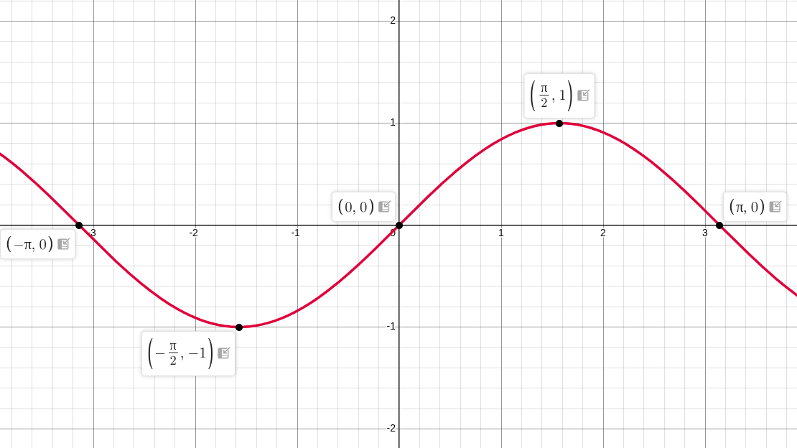
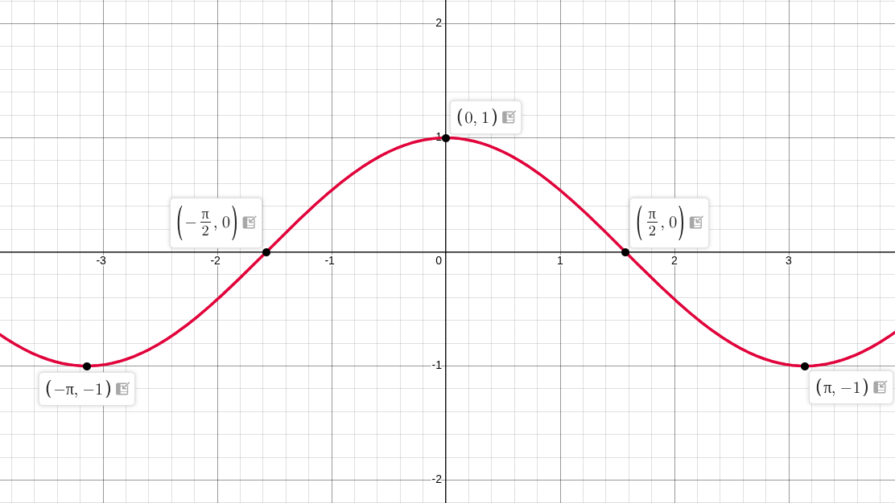
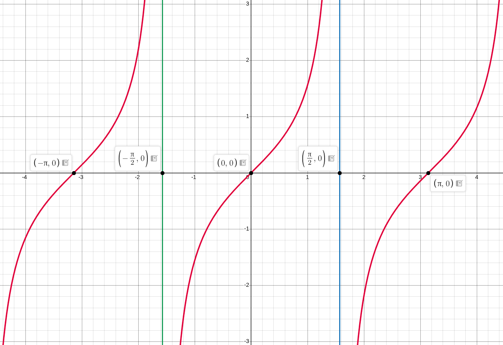
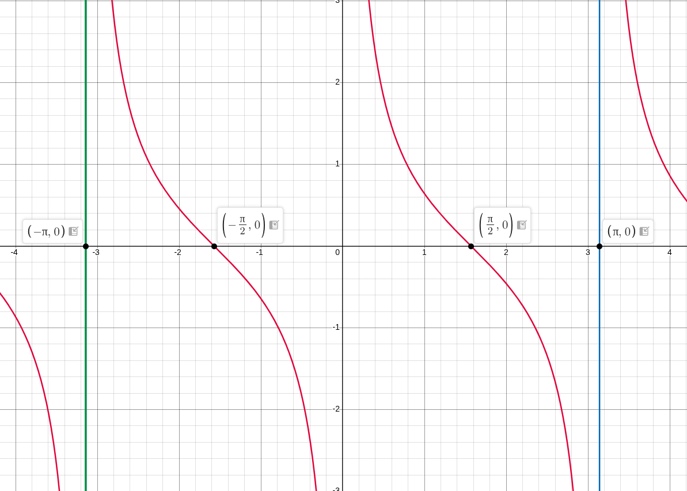
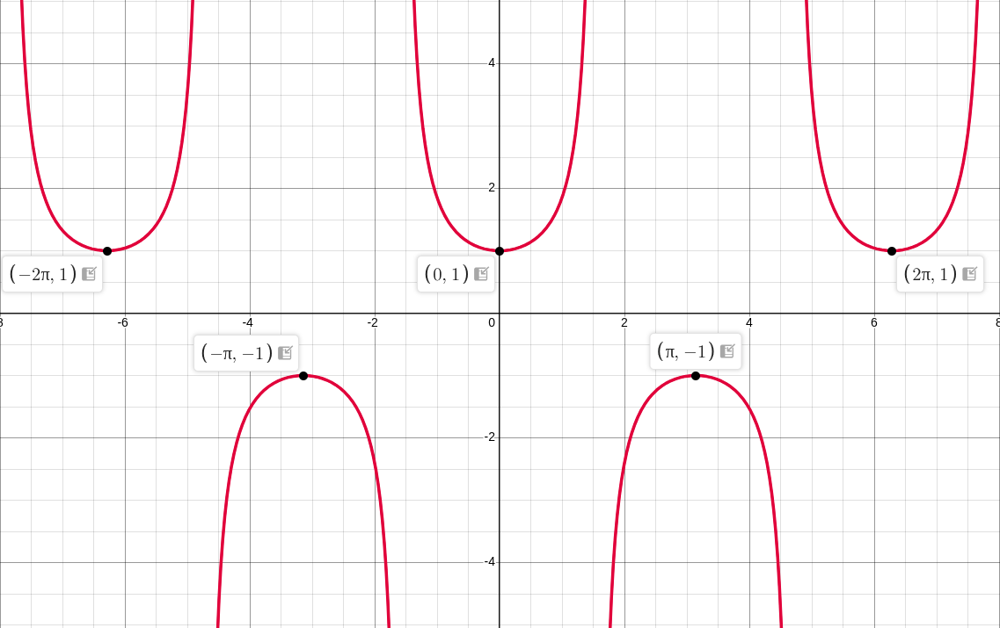
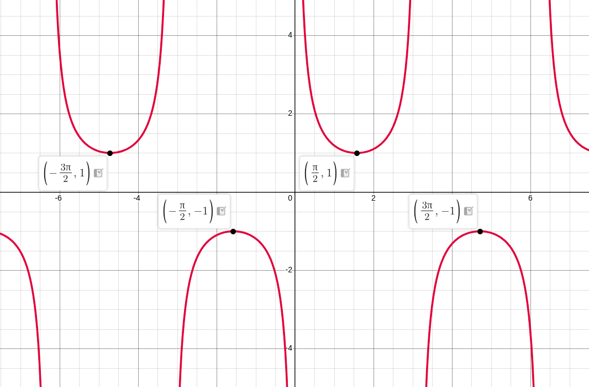

```{r}
#| echo: false
#| warning: false
#| message: false

library(readr)
library(dplyr)
library(stringr)

# =================================
# GOOGLE SHEET
# =================================

sheet_url <- "https://docs.google.com/spreadsheets/d/e/2PACX-1vSS9xAr-Vm_XPEKsvPz9A1RWtIEW3R50nqcilODNggostrkW7ms5O84Dgrp9vheOer-K8Pu5PDtsgg2/pub?output=csv"

lectures <- read_csv(
  sheet_url,
  show_col_types = FALSE
)

# =================================
# DETECT CURRENT QMD FILE
# =================================

current_file <- knitr::current_input(
  dir = FALSE
)

current_filename <- basename(
  current_file
)

# =================================
# EXTRACT LECTURE NUMBER
# =================================

lecture_match <- str_match(
  current_filename,
  "lecture-([0-9]+)"
)

if (is.na(lecture_match[1, 2])) {

  stop(
    paste0(
      "Could not detect lecture number from file: ",
      current_filename
    )
  )

}

lecture_no <- as.integer(
  lecture_match[1, 2]
)

# =================================
# FIND MATCHING LECTURE
# =================================

lecture <- lectures %>%
  filter(
    !is.na(`CLASS NO.`),
    as.integer(`CLASS NO.`) == lecture_no
  ) %>%
  slice(1)

# =================================
# DEFAULT VALUES
# =================================

lecture_date <- ""
chapter <- ""
content <- ""

# =================================
# GET DATA
# =================================

if (nrow(lecture) > 0) {

  lecture_date <- lecture$`TUTORING DATE`[1]

  chapter <- lecture$`CHAPTERS & PAPER`[1]

  content <- lecture$CONTENT[1]

}

# =================================
# HANDLE NA
# =================================

if (is.na(lecture_date)) {
  lecture_date <- ""
}

if (is.na(chapter)) {
  chapter <- ""
}

if (is.na(content)) {
  content <- ""
}

# =================================
# CONVERT TO CHARACTER
# =================================

lecture_date <- str_trim(
  as.character(lecture_date)
)

chapter <- str_trim(
  as.character(chapter)
)

content <- str_trim(
  as.character(content)
)

# =================================
# FORMAT CHAPTER LINE BREAKS
# =================================

chapter <- str_replace_all(
  chapter,
  "\\r?\\n",
  "<br>"
)

# =================================
# WEEKLY EXAM DETECTION
# =================================

weekly_exam_match <- str_match(
  content,
  "^\\s*([0-9]+)\\s*-\\s*Weekly exam of previous lectures and problem solving\\s*$"
)

is_weekly_exam <- !is.na(
  weekly_exam_match[1, 1]
)

# =================================
# WEEKLY EXAM NUMBER
# =================================

weekly_exam_no <- ""

if (is_weekly_exam) {

  weekly_exam_no <- sprintf(
    "%02d",
    as.integer(
      weekly_exam_match[1, 2]
    )
  )

}

# =================================
# WEEKLY EXAM DESCRIPTION
# =================================

weekly_exam_description <- ""

if (is_weekly_exam) {

  weekly_exam_description <-
    "Weekly exam of previous lectures and problem solving"

}

# =================================
# WEEKLY EXAM BADGE
# =================================

weekly_badge <- ""

if (is_weekly_exam) {

  weekly_badge <- paste0(
    '<span class="weekly-exam-corner-badge">',
    'WEEKLY ',
    weekly_exam_no,
    '</span>'
  )

}

```

::::::: lecture-header-card
::::: lecture-header-main
[HIGHER MATHEMATICS]{.lecture-subject}

::: lecture-title-row
# Lecture `r sprintf("%02d", lecture_no)`
:::

::: lecture-chapter
`r chapter`
:::

`r if (!is_weekly_exam) content`
:::::

::: lecture-header-date
<span>`r lecture_date`</span>
:::

`r weekly_badge`
:::::::

# Trigonometric Functions

In mathematical analysis, trigonometric functions are real-valued functions that relate an angle of a right-angled triangle to ratios of two side lengths, or more generally, map real numbers representing arc lengths on a unit circle to Cartesian coordinates.

### Domains and Ranges Summary

| Function | Notation | Domain ($\operatorname{Dom}$) | Range ($\operatorname{Ran}$) | Period ($T$) |
|:--------------|:--------------|:--------------|:--------------|:--------------|
| **Sine** | $y = \sin x$ | $\mathbb{R} = (-\infty, \infty)$ | $[-1, 1]$ | $2\pi$ |
| **Cosine** | $y = \cos x$ | $\mathbb{R} = (-\infty, \infty)$ | $[-1, 1]$ | $2\pi$ |
| **Tangent** | $y = \tan x$ | $\mathbb{R} \setminus \left\{ \frac{(2n+1)\pi}{2} \mid n \in \mathbb{Z} \right\}$ | $\mathbb{R} = (-\infty, \infty)$ | $\pi$ |
| **Cotangent** | $y = \cot x$ | $\mathbb{R} \setminus \{ n\pi \mid n \in \mathbb{Z} \}$ | $\mathbb{R} = (-\infty, \infty)$ | $\pi$ |
| **Secant** | $y = \sec x$ | $\mathbb{R} \setminus \left\{ \frac{(2n+1)\pi}{2} \mid n \in \mathbb{Z} \right\}$ | $(-\infty, -1] \cup [1, \infty)$ | $2\pi$ |
| **Cosecant** | $y = \csc x$ | $\mathbb{R} \setminus \{ n\pi \mid n \in \mathbb{Z} \}$ | $(-\infty, -1] \cup [1, \infty)$ | $2\pi$ |

------------------------------------------------------------------------

# Detailed Analysis of Functions

## $y = \sin x$

### Domain, Range, and Period

-   **Domain:** $x \in \mathbb{R}$
-   **Range:** $y \in [-1, 1]$
-   **Period:** $2\pi \text{ rad} = 360^\circ$

### Plotting Table ($-90^\circ$ to $90^\circ$ at $15^\circ$ Intervals)

| $x$ (Degrees) | $x$ (Radians) | Exact Value | Decimal Approximation ($y$) |
|:----------------:|:----------------:|:----------------:|:----------------:|
| $-90^\circ$ | $-\frac{\pi}{2}$ | $-1$ | $-1.000$ |
| $-75^\circ$ | $-\frac{5\pi}{12}$ | $-\frac{\sqrt{6}+\sqrt{2}}{4}$ | $-0.966$ |
| $-60^\circ$ | $-\frac{\pi}{3}$ | $-\frac{\sqrt{3}}{2}$ | $-0.866$ |
| $-45^\circ$ | $-\frac{\pi}{4}$ | $-\frac{1}{\sqrt{2}}$ | $-0.707$ |
| $-30^\circ$ | $-\frac{\pi}{6}$ | $-\frac{1}{2}$ | $-0.500$ |
| $-15^\circ$ | $-\frac{\pi}{12}$ | $-\frac{\sqrt{6}-\sqrt{2}}{4}$ | $-0.259$ |
| $0^\circ$ | $0$ | $0$ | $0.000$ |
| $15^\circ$ | $\frac{\pi}{12}$ | $\frac{\sqrt{6}-\sqrt{2}}{4}$ | $0.259$ |
| $30^\circ$ | $\frac{\pi}{6}$ | $\frac{1}{2}$ | $0.500$ |
| $45^\circ$ | $\frac{\pi}{4}$ | $\frac{1}{\sqrt{2}}$ | $0.707$ |
| $60^\circ$ | $\frac{\pi}{3}$ | $\frac{\sqrt{3}}{2}$ | $0.866$ |
| $75^\circ$ | $\frac{5\pi}{12}$ | $\frac{\sqrt{6}+\sqrt{2}}{4}$ | $0.966$ |
| $90^\circ$ | $\frac{\pi}{2}$ | $1$ | $1.000$ |

#### Drawing this points

```{r}
#| echo: false
#| fig-width: 7
#| fig-height: 4
#| fig-align: "center"
#| fig-cap: "Graph of y = sin(x) from -90° to 90°"

# Generate x values in degrees and convert to radians
x_deg <- seq(-90, 90, by = 1)
x_rad <- x_deg * (pi / 180)
y <- sin(x_rad)

# Set base margins
par(mar = c(4.5, 4.5, 2, 2))

# Plot the sine wave
plot(x_deg, y, type = "l", col = "royalblue", lwd = 2.5,
     xlab = "x (Degrees)", ylab = "y = sin(x)",
     xaxt = "n", yaxt = "n", frame.plot = TRUE)

# Custom axes ticks
axis(1, at = seq(-90, 90, by = 30), labels = paste0(seq(-90, 90, by = 30), "°"))
axis(2, at = seq(-1, 1, by = 0.5), las = 1)

# Add reference lines
abline(h = 0, v = 0, col = "gray40", lty = 2)
grid(nx = NULL, ny = NULL, col = "gray85", lty = 3)

# Highlight plotting points from -90 to 90 at 15-degree intervals
pts_deg <- seq(-90, 90, by = 15)
pts_y <- sin(pts_deg * (pi / 180))
points(pts_deg, pts_y, col = "firebrick", pch = 19, cex = 0.9)

```

#### A visualization for more angles



> *Graph description:* Plot a smooth continuous wave passing through origin $(0,0)$, bounded between $y = -1$ and $y = 1$. Show symmetry across the origin.

### Observable Properties

-   **Odd Function Symmetry:** Symmetric about the origin, verifying $\sin(-x) = -\sin x$.
-   **Continuity:** Smooth and continuous without break across the entire real line.
-   **Boundedness:** Bound strictly within the interval $[-1, 1]$.

------------------------------------------------------------------------

## $y = \cos x$

### Domain, Range, and Period

-   **Domain:** $x \in \mathbb{R}$
-   **Range:** $y \in [-1, 1]$
-   **Period:** $2\pi \text{ rad} = 360^\circ$

### Plotting Table ($-90^\circ$ to $90^\circ$ at $15^\circ$ Intervals)

| $x$ (Degrees) | $x$ (Radians) | Exact Value | Decimal Approximation ($y$) |
|:----------------:|:----------------:|:----------------:|:----------------:|
| $-90^\circ$ | $-\frac{\pi}{2}$ | $0$ | $0.000$ |
| $-75^\circ$ | $-\frac{5\pi}{12}$ | $\frac{\sqrt{6}-\sqrt{2}}{4}$ | $0.259$ |
| $-60^\circ$ | $-\frac{\pi}{3}$ | $\frac{1}{2}$ | $0.500$ |
| $-45^\circ$ | $-\frac{\pi}{4}$ | $\frac{1}{\sqrt{2}}$ | $0.707$ |
| $-30^\circ$ | $-\frac{\pi}{6}$ | $\frac{\sqrt{3}}{2}$ | $0.866$ |
| $-15^\circ$ | $-\frac{\pi}{12}$ | $\frac{\sqrt{6}+\sqrt{2}}{4}$ | $0.966$ |
| $0^\circ$ | $0$ | $1$ | $1.000$ |
| $15^\circ$ | $\frac{\pi}{12}$ | $\frac{\sqrt{6}+\sqrt{2}}{4}$ | $0.966$ |
| $30^\circ$ | $\frac{\pi}{6}$ | $\frac{\sqrt{3}}{2}$ | $0.866$ |
| $45^\circ$ | $\frac{\pi}{4}$ | $\frac{1}{\sqrt{2}}$ | $0.707$ |
| $60^\circ$ | $\frac{\pi}{3}$ | $\frac{1}{2}$ | $0.500$ |
| $75^\circ$ | $\frac{5\pi}{12}$ | $\frac{\sqrt{6}-\sqrt{2}}{4}$ | $0.259$ |
| $90^\circ$ | $\frac{\pi}{2}$ | $0$ | $0.000$ |

#### Drawing this points

```{r}
#| echo: false
#| fig-width: 7
#| fig-height: 4
#| fig-align: "center"
#| fig-cap: "Graph of y = cos(x) from -90° to 90°"

# Generate x values in degrees and convert to radians
x_deg <- seq(-90, 90, by = 1)
x_rad <- x_deg * (pi / 180)
y <- cos(x_rad)

# Set base margins
par(mar = c(4.5, 4.5, 2, 2))

# Plot the cosine wave
plot(x_deg, y, type = "l", col = "royalblue", lwd = 2.5,
     xlab = "x (Degrees)", ylab = "y = cos(x)",
     xaxt = "n", yaxt = "n", frame.plot = TRUE)

# Custom axes ticks
axis(1, at = seq(-90, 90, by = 30), labels = paste0(seq(-90, 90, by = 30), "°"))
axis(2, at = seq(0, 1, by = 0.25), las = 1)

# Add reference lines
abline(h = 0, v = 0, col = "gray40", lty = 2)
grid(nx = NULL, ny = NULL, col = "gray85", lty = 3)

# Highlight plotting points from -90 to 90 at 15-degree intervals
pts_deg <- seq(-90, 90, by = 15)
pts_y <- cos(pts_deg * (pi / 180))
points(pts_deg, pts_y, col = "firebrick", pch = 19, cex = 0.9)

```

#### A visualization for more angles



> *Graph description:* Plot a continuous wave with a peak at $(0,1)$ and roots at $x = -\frac{\pi}{2}$ and $x = \frac{\pi}{2}$. Show symmetry across the y-axis.

### Observable Properties

-   **Even Function Symmetry:** Symmetric about the y-axis, verifying $\cos(-x) = \cos x$.
-   **Phase Shift Relation:** Shifted version of sine wave: $\cos x = \sin\left(x + \frac{\pi}{2}\right)$.
-   **Extrema:** Attains its maximum value $1$ at $x = 0$.

------------------------------------------------------------------------

## $y = \tan x$

### Domain, Range, and Period

-   **Domain:** $\mathbb{R} \setminus \left\{ \dots, -\frac{\pi}{2}, \frac{\pi}{2}, \frac{3\pi}{2}, \dots \right\}$
-   **Range:** $y \in (-\infty, \infty)$
-   **Period:** $\pi \text{ rad} = 180^\circ$

### Plotting Table ($-90^\circ$ to $90^\circ$ at $15^\circ$ Intervals)

| $x$ (Degrees) | $x$ (Radians) | Exact Value | Decimal Approximation ($y$) |
|:----------------:|:----------------:|:----------------:|:----------------:|
| $-90^\circ$ | $-\frac{\pi}{2}$ | Undefined | $-\infty$ (Asymptote) |
| $-75^\circ$ | $-\frac{5\pi}{12}$ | $-(2+\sqrt{3})$ | $-3.732$ |
| $-60^\circ$ | $-\frac{\pi}{3}$ | $-\sqrt{3}$ | $-1.732$ |
| $-45^\circ$ | $-\frac{\pi}{4}$ | $-1$ | $-1.000$ |
| $-30^\circ$ | $-\frac{\pi}{6}$ | $-\frac{1}{\sqrt{3}}$ | $-0.577$ |
| $-15^\circ$ | $-\frac{\pi}{12}$ | $-(2-\sqrt{3})$ | $-0.268$ |
| $0^\circ$ | $0$ | $0$ | $0.000$ |
| $15^\circ$ | $\frac{\pi}{12}$ | $2-\sqrt{3}$ | $0.268$ |
| $30^\circ$ | $\frac{\pi}{6}$ | $\frac{1}{\sqrt{3}}$ | $0.577$ |
| $45^\circ$ | $\frac{\pi}{4}$ | $1$ | $1.000$ |
| $60^\circ$ | $\frac{\pi}{3}$ | $\sqrt{3}$ | $1.732$ |
| $75^\circ$ | $\frac{5\pi}{12}$ | $2+\sqrt{3}$ | $3.732$ |
| $90^\circ$ | $\frac{\pi}{2}$ | Undefined | $+\infty$ (Asymptote) |

#### Drawing this points

```{r}
#| echo: false
#| fig-width: 7
#| fig-height: 4.5
#| fig-align: "center"
#| fig-cap: "Graph of y = tan(x) from -90° to 90° with Vertical Asymptotes"

# Generate x values approaching asymptotes (-89° to 89°)
x_deg <- seq(-89, 89, length.out = 500)
x_rad <- x_deg * (pi / 180)
y <- tan(x_rad)

# Set base margins
par(mar = c(4.5, 4.5, 2, 2))

# Plot the tangent curve
plot(x_deg, y, type = "l", col = "royalblue", lwd = 2.5,
     xlab = "x (Degrees)", ylab = "y = tan(x)",
     xaxt = "n", yaxt = "n", frame.plot = TRUE,
     ylim = c(-4, 4))

# Custom axes ticks
axis(1, at = seq(-90, 90, by = 30), labels = paste0(seq(-90, 90, by = 30), "°"))
axis(2, at = seq(-4, 4, by = 1), las = 1)

# Add reference lines and vertical asymptotes
abline(h = 0, v = 0, col = "gray40", lty = 2)
abline(v = c(-90, 90), col = "firebrick", lty = 2, lwd = 1.5)
grid(nx = NULL, ny = NULL, col = "gray85", lty = 3)

# Highlight valid plotting points within (-90°, 90°)
pts_deg <- seq(-75, 75, by = 15)
pts_y <- tan(pts_deg * (pi / 180))
points(pts_deg, pts_y, col = "firebrick", pch = 19, cex = 0.9)
```
#### A visualization for more angles



> *Graph description:* Plot vertical asymptotic lines at $x = -\frac{\pi}{2}$ and $x = \frac{\pi}{2}$. Show the strictly increasing monotonic curve passing through $(0,0)$.

### Observable Properties

-   **Vertical Asymptotes:** Asymptotes occur where $\cos x = 0$, i.e., $x = \pm 90^\circ$.
-   **Monotonic Increasing:** Strictly increases on each open interval between its asymptotes.
-   **Odd Function:** $\tan(-x) = -\tan x$.

------------------------------------------------------------------------

## $y = \cot x$

### Domain, Range, and Period

-   **Domain:** $\mathbb{R} \setminus \{ \dots, -\pi, 0, \pi, \dots \}$
-   **Range:** $y \in (-\infty, \infty)$
-   **Period:** $\pi \text{ rad} = 180^\circ$

### Plotting Table ($-90^\circ$ to $90^\circ$ at $15^\circ$ Intervals)

| $x$ (Degrees) | $x$ (Radians) | Exact Value | Decimal Approximation ($y$) |
|:----------------:|:----------------:|:----------------:|:----------------:|
| $-90^\circ$ | $-\frac{\pi}{2}$ | $0$ | $0.000$ |
| $-75^\circ$ | $-\frac{5\pi}{12}$ | $-(2-\sqrt{3})$ | $-0.268$ |
| $-60^\circ$ | $-\frac{\pi}{3}$ | $-\frac{1}{\sqrt{3}}$ | $-0.577$ |
| $-45^\circ$ | $-\frac{\pi}{4}$ | $-1$ | $-1.000$ |
| $-30^\circ$ | $-\frac{\pi}{6}$ | $-\sqrt{3}$ | $-1.732$ |
| $-15^\circ$ | $-\frac{\pi}{12}$ | $-(2+\sqrt{3})$ | $-3.732$ |
| $0^\circ$ | $0$ | Undefined | $\pm\infty$ (Asymptote) |
| $15^\circ$ | $\frac{\pi}{12}$ | $2+\sqrt{3}$ | $3.732$ |
| $30^\circ$ | $\frac{\pi}{6}$ | $\sqrt{3}$ | $1.732$ |
| $45^\circ$ | $\frac{\pi}{4}$ | $1$ | $1.000$ |
| $60^\circ$ | $\frac{\pi}{3}$ | $\frac{1}{\sqrt{3}}$ | $0.577$ |
| $75^\circ$ | $\frac{5\pi}{12}$ | $2-\sqrt{3}$ | $0.268$ |
| $90^\circ$ | $\frac{\pi}{2}$ | $0$ | $0.000$ |

#### Drawing this points

```{r}
#| echo: false
#| fig-width: 7
#| fig-height: 4.5
#| fig-align: "center"
#| fig-cap: "Graph of y = cot(x) from -90° to 90° with Vertical Asymptote at x = 0°"

# Generate x values in two branches to avoid the asymptote at x = 0
x_neg <- seq(-90, -1, length.out = 250)
x_pos <- seq(1, 90, length.out = 250)

y_neg <- 1 / tan(x_neg * (pi / 180))
y_pos <- 1 / tan(x_pos * (pi / 180))

# Set base margins
par(mar = c(4.5, 4.5, 2, 2))

# Plot negative branch
plot(x_neg, y_neg, type = "l", col = "royalblue", lwd = 2.5,
     xlab = "x (Degrees)", ylab = "y = cot(x)",
     xaxt = "n", yaxt = "n", frame.plot = TRUE,
     xlim = c(-90, 90), ylim = c(-4, 4))

# Add positive branch
lines(x_pos, y_pos, col = "royalblue", lwd = 2.5)

# Custom axes ticks
axis(1, at = seq(-90, 90, by = 30), labels = paste0(seq(-90, 90, by = 30), "°"))
axis(2, at = seq(-4, 4, by = 1), las = 1)

# Add reference lines and vertical asymptote at x = 0
abline(h = 0, col = "gray40", lty = 2)
abline(v = 0, col = "firebrick", lty = 2, lwd = 1.5)
grid(nx = NULL, ny = NULL, col = "gray85", lty = 3)

# Highlight valid plotting points from table excluding x = 0°
pts_deg <- c(seq(-90, -15, by = 15), seq(15, 90, by = 15))
pts_y <- 1 / tan(pts_deg * (pi / 180))
points(pts_deg, pts_y, col = "firebrick", pch = 19, cex = 0.9)
```

#### A visualization for more angles



> *Graph description:* Plot vertical asymptotic line at $x = 0$. Show strictly decreasing curves passing through $y=0$ at $x = -\frac{\pi}{2}$ and $x = \frac{\pi}{2}$.

### Observable Properties

-   **Vertical Asymptote at Origin:** Asymptote exists at $x = 0^\circ$ because $\sin(0) = 0$.
-   **Monotonic Decreasing:** Strictly decreases between consecutive asymptotes.
-   **Reciprocal Symmetry:** $\cot x = \frac{1}{\tan x}$.

------------------------------------------------------------------------

## $y = \sec x$

### Domain, Range, and Period

-   **Domain:** $\mathbb{R} \setminus \left\{ \frac{(2n+1)\pi}{2} \mid n \in \mathbb{Z} \right\}$
-   **Range:** $y \in (-\infty, -1] \cup [1, \infty)$
-   **Period:** $2\pi \text{ rad} = 360^\circ$

### Plotting Table ($-90^\circ$ to $90^\circ$ at $15^\circ$ Intervals)

| $x$ (Degrees) | $x$ (Radians) | Exact Value | Decimal Approximation ($y$) |
|:----------------:|:----------------:|:----------------:|:----------------:|
| $-90^\circ$ | $-\frac{\pi}{2}$ | Undefined | $+\infty$ (Asymptote) |
| $-75^\circ$ | $-\frac{5\pi}{12}$ | $\sqrt{6}+\sqrt{2}$ | $3.864$ |
| $-60^\circ$ | $-\frac{\pi}{3}$ | $2$ | $2.000$ |
| $-45^\circ$ | $-\frac{\pi}{4}$ | $\sqrt{2}$ | $1.414$ |
| $-30^\circ$ | $-\frac{\pi}{6}$ | $\frac{2}{\sqrt{3}}$ | $1.155$ |
| $-15^\circ$ | $-\frac{\pi}{12}$ | $\sqrt{6}-\sqrt{2}$ | $1.035$ |
| $0^\circ$ | $0$ | $1$ | $1.000$ |
| $15^\circ$ | $\frac{\pi}{12}$ | $\sqrt{6}-\sqrt{2}$ | $1.035$ |
| $30^\circ$ | $\frac{\pi}{6}$ | $\frac{2}{\sqrt{3}}$ | $1.155$ |
| $45^\circ$ | $\frac{\pi}{4}$ | $\sqrt{2}$ | $1.414$ |
| $60^\circ$ | $\frac{\pi}{3}$ | $2$ | $2.000$ |
| $75^\circ$ | $\frac{5\pi}{12}$ | $\sqrt{6}+\sqrt{2}$ | $3.864$ |
| $90^\circ$ | $\frac{\pi}{2}$ | Undefined | $+\infty$ (Asymptote) |

#### Drawing this points

```{r}
#| echo: false
#| fig-width: 7
#| fig-height: 4.5
#| fig-align: "center"
#| fig-cap: "Graph of y = sec(x) from -90° to 90° with Vertical Asymptotes"

# Generate x values approaching asymptotes (-89° to 89°)
x_deg <- seq(-89, 89, length.out = 500)
x_rad <- x_deg * (pi / 180)
y <- 1 / cos(x_rad)

# Set base margins
par(mar = c(4.5, 4.5, 2, 2))

# Plot the secant curve
plot(x_deg, y, type = "l", col = "royalblue", lwd = 2.5,
     xlab = "x (Degrees)", ylab = "y = sec(x)",
     xaxt = "n", yaxt = "n", frame.plot = TRUE,
     ylim = c(0, 5))

# Custom axes ticks
axis(1, at = seq(-90, 90, by = 30), labels = paste0(seq(-90, 90, by = 30), "°"))
axis(2, at = seq(0, 5, by = 1), las = 1)

# Add reference line at y = 1 and vertical asymptotes at -90° and 90°
abline(h = 1, col = "gray40", lty = 2)
abline(v = c(-90, 90), col = "firebrick", lty = 2, lwd = 1.5)
grid(nx = NULL, ny = NULL, col = "gray85", lty = 3)

# Highlight valid plotting points within (-90°, 90°)
pts_deg <- seq(-75, 75, by = 15)
pts_y <- 1 / cos(pts_deg * (pi / 180))
points(pts_deg, pts_y, col = "firebrick", pch = 19, cex = 0.9)
```

#### A visualization for more angles



> *Graph description:* Plot vertical asymptotes at $x = \pm \frac{\pi}{2}$. Draw a U-shaped curve with a local minimum at $(0, 1)$ staying strictly above $y = 1$ in this domain segment.

### Observable Properties

-   **Range Gap:** No graph exists in the open interval $(-1, 1)$.
-   **Even Function:** Symmetric with respect to the y-axis, $\sec(-x) = \sec x$.
-   **Local Minimum:** Reaches local minimum at $(0, 1)$.

------------------------------------------------------------------------

## $y = \csc x$

### Domain, Range, and Period

-   **Domain:** $\mathbb{R} \setminus \{ n\pi \mid n \in \mathbb{Z} \}$
-   **Range:** $y \in (-\infty, -1] \cup [1, \infty)$
-   **Period:** $2\pi \text{ rad} = 360^\circ$

### Plotting Table ($-90^\circ$ to $90^\circ$ at $15^\circ$ Intervals)

| $x$ (Degrees) | $x$ (Radians) | Exact Value | Decimal Approximation ($y$) |
|:----------------:|:----------------:|:----------------:|:----------------:|
| $-90^\circ$ | $-\frac{\pi}{2}$ | $-1$ | $-1.000$ |
| $-75^\circ$ | $-\frac{5\pi}{12}$ | $-(\sqrt{6}-\sqrt{2})$ | $-1.035$ |
| $-60^\circ$ | $-\frac{\pi}{3}$ | $-\frac{2}{\sqrt{3}}$ | $-1.155$ |
| $-45^\circ$ | $-\frac{\pi}{4}$ | $-\sqrt{2}$ | $-1.414$ |
| $-30^\circ$ | $-\frac{\pi}{6}$ | $-2$ | $-2.000$ |
| $-15^\circ$ | $-\frac{\pi}{12}$ | $-(\sqrt{6}+\sqrt{2})$ | $-3.864$ |
| $0^\circ$ | $0$ | Undefined | $\pm\infty$ (Asymptote) |
| $15^\circ$ | $\frac{\pi}{12}$ | $\sqrt{6}+\sqrt{2}$ | $3.864$ |
| $30^\circ$ | $\frac{\pi}{6}$ | $2$ | $2.000$ |
| $45^\circ$ | $\frac{\pi}{4}$ | $\sqrt{2}$ | $1.414$ |
| $60^\circ$ | $\frac{\pi}{3}$ | $\frac{2}{\sqrt{3}}$ | $1.155$ |
| $75^\circ$ | $\frac{5\pi}{12}$ | $\sqrt{6}-\sqrt{2}$ | $1.035$ |
| $90^\circ$ | $\frac{\pi}{2}$ | $1$ | $1.000$ |

#### Drawing this points

```{r}
#| echo: false
#| fig-width: 7
#| fig-height: 4.5
#| fig-align: "center"
#| fig-cap: "Graph of y = csc(x) from -90° to 90° with Vertical Asymptote at x = 0°"

# Generate x values in two branches to avoid the asymptote at x = 0
x_neg <- seq(-90, -1, length.out = 250)
x_pos <- seq(1, 90, length.out = 250)

y_neg <- 1 / sin(x_neg * (pi / 180))
y_pos <- 1 / sin(x_pos * (pi / 180))

# Set base margins
par(mar = c(4.5, 4.5, 2, 2))

# Plot negative branch
plot(x_neg, y_neg, type = "l", col = "royalblue", lwd = 2.5,
     xlab = "x (Degrees)", ylab = "y = csc(x)",
     xaxt = "n", yaxt = "n", frame.plot = TRUE,
     xlim = c(-90, 90), ylim = c(-5, 5))

# Add positive branch
lines(x_pos, y_pos, col = "royalblue", lwd = 2.5)

# Custom axes ticks
axis(1, at = seq(-90, 90, by = 30), labels = paste0(seq(-90, 90, by = 30), "°"))
axis(2, at = c(-5, -2, -1, 1, 2, 5), las = 1)

# Add reference lines and vertical asymptote at x = 0
abline(h = c(-1, 1), col = "gray40", lty = 2)
abline(v = 0, col = "firebrick", lty = 2, lwd = 1.5)
grid(nx = NULL, ny = NULL, col = "gray85", lty = 3)

# Highlight valid plotting points from table excluding x = 0°
pts_deg <- c(seq(-90, -15, by = 15), seq(15, 90, by = 15))
pts_y <- 1 / sin(pts_deg * (pi / 180))
points(pts_deg, pts_y, col = "firebrick", pch = 19, cex = 0.9)
```

#### A visualization for more angles



> *Graph description:* Plot vertical asymptote at $x = 0$. Show inverted U-shaped branch for $x < 0$ (local maximum at $(-90^\circ, -1)$) and upright U-shaped branch for $x > 0$ (local minimum at $(90^\circ, 1)$).

### Observable Properties

-   **Asymptote at** $x = 0$: Splitting the function into positive and negative branches.
-   **Range Gap:** Values never lie strictly between $-1$ and $1$.
-   **Odd Function Symmetry:** $\csc(-x) = -\csc x$.

::: lecture-navigation
[← Previous Lecture](lecture-02.qmd){.lecture-nav-btn}

[Next Lecture →](lecture-04.qmd){.lecture-nav-btn}
:::

<br>

::: contact-social
<a href="https://github.com/TurjoMahir"
   target="_blank"
   aria-label="GitHub"> <i class="fa-brands fa-github"></i> </a>

<a href="https://www.linkedin.com/in/md-foysal-uddin-3aa47a406/"
   target="_blank"
   aria-label="LinkedIn"> <i class="fa-brands fa-linkedin-in"></i> </a>

<a href="https://www.facebook.com/foysal.uddin.turjo.2005"
   target="_blank"
   aria-label="Facebook"> <i class="fa-brands fa-facebook-f"></i> </a>

<a href="mailto:foysaluddinturjo@gmail.com"
   aria-label="Email"> <i class="fa-solid fa-envelope"></i> </a>
:::
