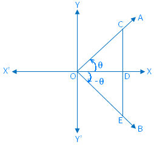
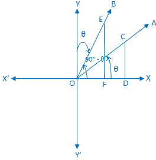
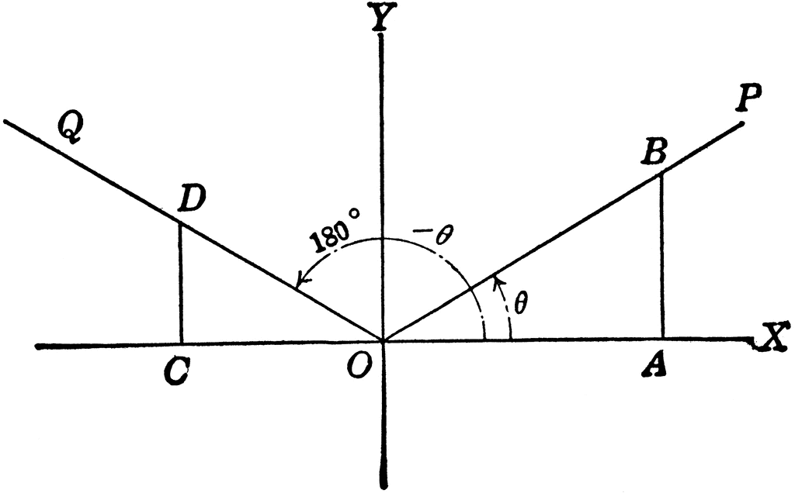
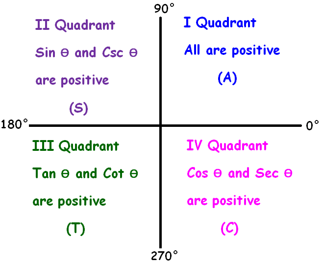
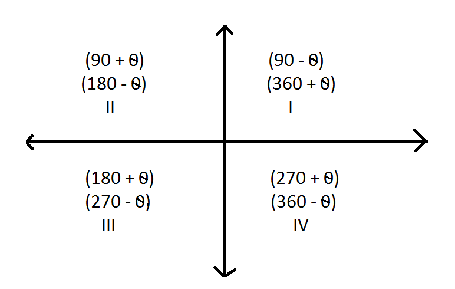

```{r}
#| echo: false
#| warning: false
#| message: false

library(readr)
library(dplyr)
library(stringr)

# =================================
# GOOGLE SHEET
# =================================

sheet_url <- "https://docs.google.com/spreadsheets/d/e/2PACX-1vSS9xAr-Vm_XPEKsvPz9A1RWtIEW3R50nqcilODNggostrkW7ms5O84Dgrp9vheOer-K8Pu5PDtsgg2/pub?output=csv"

lectures <- read_csv(
  sheet_url,
  show_col_types = FALSE
)

# =================================
# DETECT CURRENT QMD FILE
# =================================

current_file <- knitr::current_input(
  dir = FALSE
)

current_filename <- basename(
  current_file
)

# =================================
# EXTRACT LECTURE NUMBER
# =================================

lecture_match <- str_match(
  current_filename,
  "lecture-([0-9]+)"
)

if (is.na(lecture_match[1, 2])) {

  stop(
    paste0(
      "Could not detect lecture number from file: ",
      current_filename
    )
  )

}

lecture_no <- as.integer(
  lecture_match[1, 2]
)

# =================================
# FIND MATCHING LECTURE
# =================================

lecture <- lectures %>%
  filter(
    !is.na(`CLASS NO.`),
    as.integer(`CLASS NO.`) == lecture_no
  ) %>%
  slice(1)

# =================================
# DEFAULT VALUES
# =================================

lecture_date <- ""
chapter <- ""
content <- ""

# =================================
# GET DATA
# =================================

if (nrow(lecture) > 0) {

  lecture_date <- lecture$`TUTORING DATE`[1]

  chapter <- lecture$`CHAPTERS & PAPER`[1]

  content <- lecture$CONTENT[1]

}

# =================================
# HANDLE NA
# =================================

if (is.na(lecture_date)) {
  lecture_date <- ""
}

if (is.na(chapter)) {
  chapter <- ""
}

if (is.na(content)) {
  content <- ""
}

# =================================
# CONVERT TO CHARACTER
# =================================

lecture_date <- str_trim(
  as.character(lecture_date)
)

chapter <- str_trim(
  as.character(chapter)
)

content <- str_trim(
  as.character(content)
)

# =================================
# FORMAT CHAPTER LINE BREAKS
# =================================

chapter <- str_replace_all(
  chapter,
  "\\r?\\n",
  "<br>"
)

# =================================
# WEEKLY EXAM DETECTION
# =================================

weekly_exam_match <- str_match(
  content,
  "^\\s*([0-9]+)\\s*-\\s*Weekly exam of previous lectures and problem solving\\s*$"
)

is_weekly_exam <- !is.na(
  weekly_exam_match[1, 1]
)

# =================================
# WEEKLY EXAM NUMBER
# =================================

weekly_exam_no <- ""

if (is_weekly_exam) {

  weekly_exam_no <- sprintf(
    "%02d",
    as.integer(
      weekly_exam_match[1, 2]
    )
  )

}

# =================================
# WEEKLY EXAM DESCRIPTION
# =================================

weekly_exam_description <- ""

if (is_weekly_exam) {

  weekly_exam_description <-
    "Weekly exam of previous lectures and problem solving"

}

# =================================
# WEEKLY EXAM BADGE
# =================================

weekly_badge <- ""

if (is_weekly_exam) {

  weekly_badge <- paste0(
    '<span class="weekly-exam-corner-badge">',
    'MARKS 30',
    '</span>'
  )

}

```

::::::: lecture-header-card
::::: lecture-header-main
[HIGHER MATHEMATICS]{.lecture-subject}

::: lecture-title-row
# `r if (is_weekly_exam) "Weekly " else "Lecture "` `r sprintf("%02d", if (is_weekly_exam) as.integer(weekly_exam_no) else lecture_no)`
:::

::: lecture-chapter
`r chapter`
:::

`r if (!is_weekly_exam) content`
:::::

::: lecture-header-date
`r lecture_date`
:::

`r weekly_badge`
:::::::

# Introduction

<p>Here we are discussing about trigonometric ratios with associated angles. For $\theta$, associated angles would be $-\theta, (90^\circ \pm \theta), (180^\circ \pm \theta), \ldots$ etc.</p>

<br>

# Trigonometric ratios for $-\theta$

{fig-align="center" width="350" height="358"}

$$
\begin{aligned}
\sin(-\theta) &= -\sin\theta \\
\cos(-\theta) &= \cos\theta \\
\tan(-\theta) &= -\tan\theta \\
\cot(-\theta) &= -\cot\theta \\
\sec(-\theta) &= \sec\theta \\
\csc(-\theta) &= -\csc\theta
\end{aligned}
$$

# Trigonometric ratios for $90^\circ -\theta$

{fig-align="center" width="350"}

$$
\begin{aligned}
\sin(90^\circ-\theta) &= \cos\theta \\
\cos(90^\circ-\theta) &= \sin\theta \\
\tan(90^\circ-\theta) &= \cot\theta \\
\cot(90^\circ-\theta) &= \tan\theta \\
\sec(90^\circ-\theta) &= \csc\theta \\
\csc(90^\circ-\theta) &= \sec\theta
\end{aligned}
$$

# Trigonometric ratios for $180^\circ -\theta$

{fig-align="center"}

$$
\begin{aligned}
\sin(180^\circ-\theta) &= \sin\theta \\
\cos(180^\circ-\theta) &= -\cos\theta \\
\tan(180^\circ-\theta) &= -\tan\theta \\
\cot(180^\circ-\theta) &= -\cot\theta \\
\sec(180^\circ-\theta) &= -\sec\theta \\
\csc(180^\circ-\theta) &= \csc\theta
\end{aligned}
$$

# Quadrants

::::: columns
::: {.column width="40%"}
{fig-align="center" width="350"}
:::

::: {.column width="60%"}
{fig-align="center" width="400" height="280"}
:::
:::::

------------------------------------------------------------------------

# Practice test

------------------------------------------------------------------------

::: q-card

[ Question 1 ]{.q-number}

a. **(Marks 5)** If $n \in \mathbb{Z}$ then find the value of,  $\cos\left \{(2n+1)\pi + \frac{\pi}{3} \right \}$

b. **(Marks 5)** If $\sec\theta = \frac{13}{12}$ and $270^\circ < \theta < 360^\circ$ then find the value of,  $\tan\theta - \csc\theta$

c. **(Marks 5)** If $\theta = \frac{\pi}{28}$ then find the value of,  $\tan\theta \tan3\theta \tan5\theta \ldots \ldots \tan13\theta$

:::

------------------------------------------------------------------------

::: lecture-navigation
[← Previous Lecture](lecture-04.qmd){.lecture-nav-btn}

[Next Lecture →](lecture-05.qmd){.lecture-nav-btn}
:::

<br>

::: contact-social
<a href="https://github.com/TurjoMahir"
   target="_blank"
   aria-label="GitHub"> <i class="fa-brands fa-github"></i> </a>

<a href="https://www.linkedin.com/in/md-foysal-uddin-3aa47a406/"
   target="_blank"
   aria-label="LinkedIn"> <i class="fa-brands fa-linkedin-in"></i> </a>

<a href="https://www.facebook.com/foysal.uddin.turjo.2005"
   target="_blank"
   aria-label="Facebook"> <i class="fa-brands fa-facebook-f"></i> </a>

<a href="mailto:foysaluddinturjo@gmail.com"
   aria-label="Email"> <i class="fa-solid fa-envelope"></i> </a>
:::
